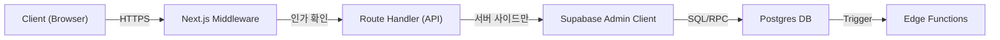
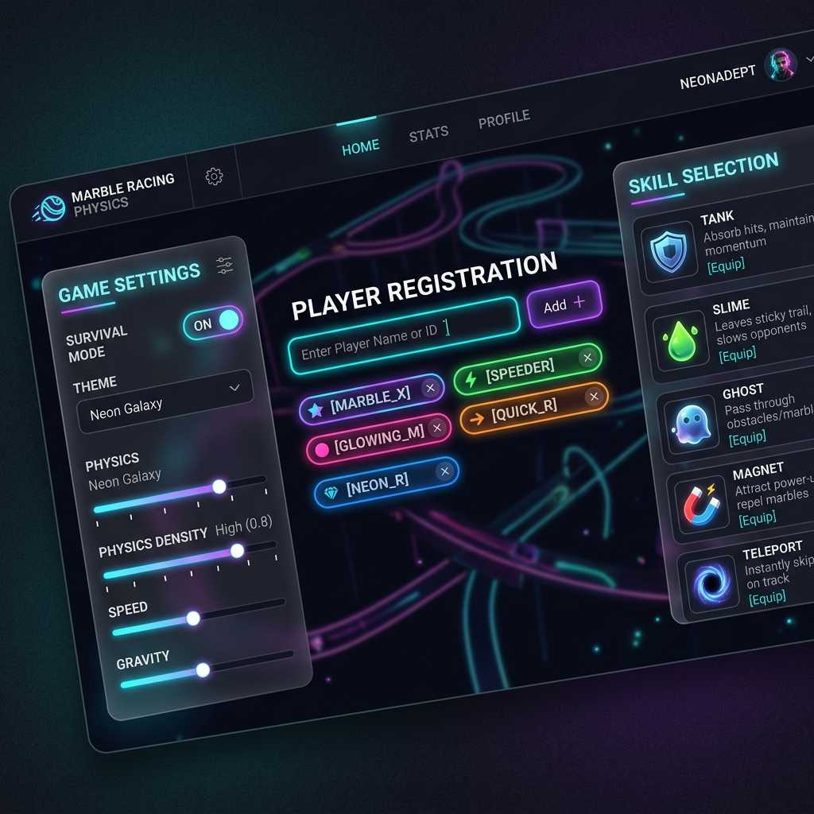
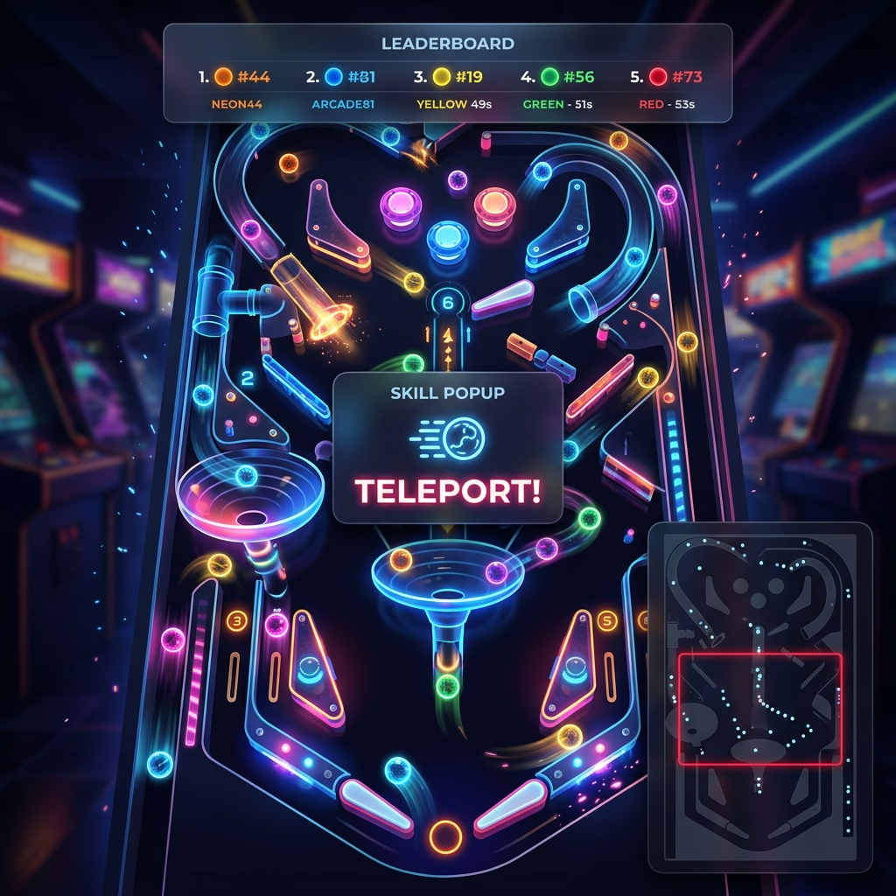
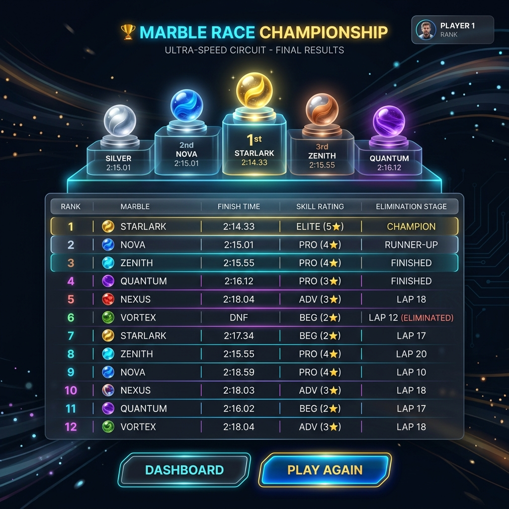
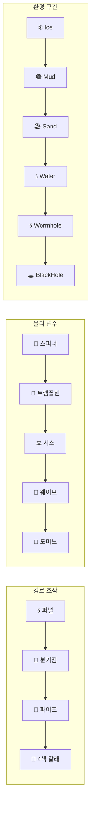
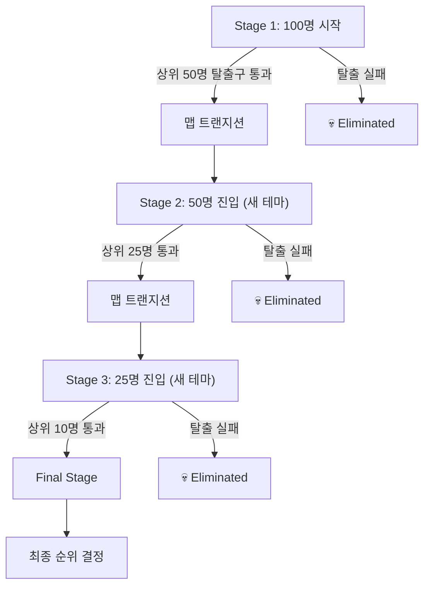
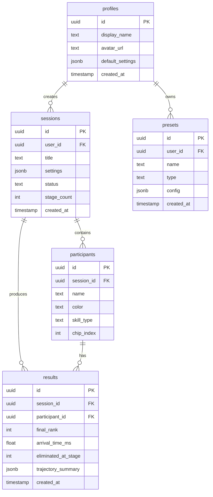

# 🎳 Rolling Thunder — PRD & 아키텍처 구현 계획서

> **물리 엔진 기반 하이엔드 무작위 추첨 웹 애플리케이션**
>
> 📹 레퍼런스 분석: [Marble Movie Makers — Park playground equipment + handmade gimmick course](https://www.youtube.com/watch?v=U8KdBx53uQg)

---

## 🔍 경쟁사 분석: Marble Roulette (lazygyu)

> 🚨 **저작권 주의**: Marble Roulette은 저작권 등록된 프리웨어입니다. Rolling Thunder는 독자적 코드베이스, 독창적 맵 디자인, 완전히 다른 UI 체계로 구축하여 저작권 이슈를 완전히 회피합니다.

### 실제 브라우저 테스트 결과

````carousel

<!-- slide -->

<!-- slide -->

````

### 기술 스택 분석

| 항목 | 분석 결과 |
|------|------------|
| **물리 엔진** | **Box2D** (WASM 컴파일, `Box2D.simd.wasm`) — C++ 기반 2D 물리 엔진 |
| **렌더링** | HTML Canvas 2D (`640×592px` 고정) |
| **프레임워크** | 바닐라 JS (SPA, Parcel 번들러) |
| **폰트** | Noto Sans KR |
| **분석** | Umami (umami.lazygyu.net) |
| **배포** | GitHub Pages (정적 호스팅) |
| **저작권** | © 2022-2026 lazygyu, 저작권 등록 완료 |

### UI/UX 분석

#### 기능 목록

| 기능 | 설명 |
|------|------|
| **맵 선택** | 4종 (운명의 수레바퀴, 버블팝, 욕망의 항아리, 밤을 달리다) |
| **참가자 입력** | 쉼표/엔터 구분, `이름*N` 복제 구문 지원 |
| **당첨 순위** | 첫번째/마지막 선택 + 순위 수 지정 |
| **스킬 활성화** | ON/OFF 토글 |
| **녹화** | 캔버스 녹화 ON/OFF |
| **섞기** | 참가자 순서 랜덤 셔플 |
| **테마** | 라이트/다크 모드 전환 |
| **미니맵** | 좌측 상단 전체 맵 축소 뷰 |
| **순위표** | 우측 상단 참가자 목록 + 완주 표시 |
| **Winner 연출** | 완료 시 확대 이미지 + "Winner" 텍스트 |

#### 강점 (벤치마킹 포인트)

| # | 강점 | 설명 |
|---|--------|------|
| 1 | **Box2D WASM 물리** | SIMD 최적화된 C++ 물리 엔진으로 정확하고 안정적인 물리 시뮬레이션 |
| 2 | **네온 비주얼** | 시안 글로우 + 어두운 배경으로 방송용 비주얼 효과 뛰어남 |
| 3 | **간결한 입력** | `수박*2,키위*2` 구문으로 반복 입력 편리 |
| 4 | **과일 아이콘** | 이름 대신 수박/키위/귤 등 과일 이미지로 시각적 구분 용이 |
| 5 | **다양한 맵** | 4가지 맵으로 다양한 경험 제공 |

#### 약점 (Rolling Thunder 개선 기회)

| # | 약점 | Rolling Thunder 개선 방향 |
|---|--------|---------------------------|
| 1 | **고정 캔버스 해상도** | 640×592px 고정 → 반응형 전체화면 지원 |
| 2 | **단일 라운드** | 한 번의 레이스로 끝 → 멀티 스테이지 서바이벌 모드 |
| 3 | **사용자 개입 불가** | 관전만 가능 → Nudge(판 흔들기) 등 사용자 인터랙션 |
| 4 | **백엔드/데이터 없음** | 정적 사이트 → Supabase 기반 세션/결과 저장 + 히스토리 |
| 5 | **단순 결과 표시** | Winner + 이미지만 → 시상대 애니메이션 + 전체 순위 테이블 |
| 6 | **비스킬 확장성** | ON/OFF만 → 참가자별 4종 개별 스킬 선택 + 물리 속성 커스터마이징 |
| 7 | **발광 트랙만** | 네온 라인만 → 다양한 장애물 시각 효과 (Ice/Mud/Wormhole 구간 색상 변화) |
| 8 | **맵 커스터마이징 불가** | 고정 4종 → 기믹 밀집도/맵 테마 등 파라미터 조절 가능 |
| 9 | **모바일 미최적화** | 하단 패널 고정 → 풀 리스폰시브 + 터치 제스처 |
| 10 | **공유/내보내기 없음** | → 스크린샷 내보내기, 링크 공유, SNS 연동 |

### 저작권 회피 가이드라인

> [!CAUTION]
> **절대 도용 금지 항목**
> 1. Marble Roulette의 맵 데이터(좌표, 구조물 배치) 직접 복제 금지
> 2. 네온 발광 트랙 디자인 유사하게 모방 금지
> 3. 과일 아이콘 에셋 사용 금지
> 4. "Marble Roulette" 이름/브랜드 사용 금지
> 5. Box2D WASM 바이너리 직접 차용 금지

> [!TIP]
> **독창성 확보 전략**
> 1. **물리 엔진**: Box2D 대신 **Rapier.js** (Rust/WASM) 사용 → 완전히 다른 엔진
> 2. **맵 디자인**: 완전히 독창적인 맵 구조 + 테마 (경쟁사 4종 vs 우리 5+종)
> 3. **UI 시스템**: 하단 패널 대신 3패널 레이아웃 + Framer Motion 애니메이션
> 4. **와이어프레임**: 완전히 다른 시각 체계 (3패널 vs 하단 오버레이)
> 5. **칩 디자인**: 과일 이미지 대신 칼러풀 추상 아이콘 + 사용자 업로드 지원

### 경쟁 우위 전략 요약

| 영역 | Marble Roulette | Rolling Thunder |
|------|-----------------|------------------|
| **물리 엔진** | Box2D WASM (C++) | **Rapier.js WASM (Rust)** — 더 새롭고, 더 빠르고, 메모리 효율적 |
| **렌더링** | Canvas 2D (640×592 고정) | **Canvas 2D 반응형** + WebGL 이펙트 (glow, 파티클) |
| **UI 프레임워크** | 바닐라 JS | **Next.js 15 + React 19 + Framer Motion** |
| **백엔드** | 없음 (정적) | **Supabase** (Auth, DB, Edge Functions) |
| **사용자 개입** | 관전만 | **Nudge(판 흔들기)** + 스킬 시스템 |
| **게임 모드** | 단일 라운드 | **멀티 스테이지 서바이벌** (5단계) |
| **맵** | 4종 고정 | **5+종 테마** + 기믹 밀집도 커스터마이징 |
| **장애물** | 경사면, 핀, 범퍼 | **10+종** (퍼널, 스피너, 트램폴린, 파이프, 도미노 등) |
| **스킬** | ON/OFF 글로벌 | **참가자별 4종 개별 선택** |
| **결과** | Winner 텍스트 | **시상대 애니메이션 + 전체 순위 테이블 + 공유** |
| **데이터** | 세션 저장 없음 | **세션/결과/프리셋 저장 + 히스토리** |
| **모바일** | 미최적화 | **풀 리스폰시브 + 터치 제스처** |
| **접근성** | 키보드만 | **키보드 + 터치 + 진동 피드백** |

---

## 📋 프로젝트 개요

기존 단순 룰렛/사다리 타기를 탈피한, **핀볼 + 마블 레이스 + 로그라이크 서바이벌** 기믹이 결합된 물리 시뮬레이션 기반 추첨 시스템.
사용자가 참가자를 입력하면, 각 참가자가 물리 법칙에 따라 핀볼 맵을 통과하며 **최종 순위가 결정**되는 비주얼 엔터테인먼트 추첨 앱.

### 코어 기술 스택

| 영역 | 기술 | 비고 |
|------|------|------|
| **Frontend** | Next.js 15 (App Router) | React 19, TypeScript |
| **스타일링** | Tailwind CSS v4 | 사용자 요청에 따라 Tailwind 사용 |
| **애니메이션** | Framer Motion | UI 트랜지션, 마이크로 인터랙션 |
| **물리 엔진** | **Rapier.js** (Rust/WASM) | 🆕 Box2D/Matter.js 대비 새롭고 빠른 2D 물리 |
| **Backend & DB** | Supabase | Auth, Postgres, Edge Functions, Realtime |
| **배포** | Vercel | Edge Runtime, Serverless Functions |
| **모니터링** | OpenTelemetry | OTLP 수집, 성능 추적 |

---

## 🏗️ 클린 아키텍처 원칙

### 보안 및 데이터 흐름



> [!CAUTION]
> **프론트엔드에서 Supabase DB 직접 접근 절대 금지.**
> 모든 데이터 CRUD는 Next.js Route Handler(`route.ts`)를 경유하고,
> `middleware.ts`에서 세션/인가를 선 검증한 뒤 처리한다.

### 핵심 아키텍처 규칙

1. **API-First**: 모든 통신은 `/api/*` Route Handler 경유
2. **Middleware Guard**: 인증이 필요한 모든 경로에 `middleware.ts` 적용
3. **Server-Only DB**: `@supabase/supabase-js`의 `createClient`는 서버 컴포넌트/Route Handler에서만 사용
4. **DB 트리거 자동화**: `on_auth_user_created` → 기본 프리셋, 아이콘 세트 자동 할당
5. **OpenTelemetry**: 렌더링 병목, Rapier.js WASM 메모리 누수, API 지연 실시간 추적

---

## 📁 디렉토리 구조

```
c:\Users\rudgn\Downloads\Rollingthunder\
├── .env.local                          # 환경 변수 (Supabase URL, Keys)
├── .env.example                        # 환경 변수 템플릿
├── next.config.ts                      # Next.js 설정
├── tailwind.config.ts                  # Tailwind CSS 설정
├── tsconfig.json                       # TypeScript 설정
├── package.json                        # 의존성 관리
│
├── public/
│   ├── fonts/                          # 커스텀 폰트 (Pretendard 등)
│   └── images/                         # 정적 이미지 에셋
│
├── src/
│   ├── app/                            # Next.js App Router
│   │   ├── layout.tsx                  # 루트 레이아웃 (폰트, 테마 프로바이더)
│   │   ├── page.tsx                    # 랜딩 페이지
│   │   ├── globals.css                 # 전역 CSS (Tailwind 포함)
│   │   │
│   │   ├── (auth)/                     # 인증 관련 라우트 그룹
│   │   │   ├── login/page.tsx          # 로그인 페이지
│   │   │   └── callback/route.ts       # OAuth 콜백
│   │   │
│   │   ├── dashboard/                  # 대시보드 (메인 셋업 화면)
│   │   │   ├── layout.tsx              # 대시보드 레이아웃
│   │   │   └── page.tsx                # 대시보드 메인
│   │   │
│   │   ├── game/                       # 게임 플레이 화면
│   │   │   ├── [sessionId]/
│   │   │   │   └── page.tsx            # 세션별 게임 화면
│   │   │   └── layout.tsx              # 게임 레이아웃 (전체화면 지원)
│   │   │
│   │   ├── results/                    # 결과 화면
│   │   │   └── [sessionId]/
│   │   │       └── page.tsx            # 세션별 결과 보기
│   │   │
│   │   └── api/                        # Route Handlers (Backend)
│   │       ├── sessions/
│   │       │   ├── route.ts            # POST: 세션 생성, GET: 세션 목록
│   │       │   └── [id]/
│   │       │       └── route.ts        # GET/PUT/DELETE: 개별 세션 CRUD
│   │       ├── participants/
│   │       │   └── route.ts            # POST: 참가자 일괄 등록
│   │       ├── presets/
│   │       │   └── route.ts            # GET/POST: 맵/스킬 프리셋 관리
│   │       └── results/
│   │           └── route.ts            # POST: 결과 저장, GET: 결과 조회
│   │
│   ├── components/                     # UI 컴포넌트
│   │   ├── ui/                         # 범용 UI 프리미티브
│   │   │   ├── Button.tsx
│   │   │   ├── Slider.tsx
│   │   │   ├── Toggle.tsx
│   │   │   ├── Chip.tsx                # 참가자 이름 칩 컴포넌트
│   │   │   ├── Dropdown.tsx
│   │   │   └── GaugeBar.tsx            # Nudge 게이지 바
│   │   │
│   │   ├── dashboard/                  # 대시보드 전용 컴포넌트
│   │   │   ├── SettingsPanel.tsx        # 좌측: 테마, 스테이지, 기믹 밀집도
│   │   │   ├── SmartInput.tsx           # 중앙: 지능형 텍스트 파서 + 칩 변환
│   │   │   ├── PlayerDeck.tsx           # 중앙: 참가자 칩 목록 그리드
│   │   │   └── SkillConfigPanel.tsx     # 우측: 스킬 설정 패널
│   │   │
│   │   ├── game/                       # 게임 플레이 전용 컴포넌트
│   │   │   ├── PhysicsCanvas.tsx        # Rapier.js 메인 캔버스 (핵심)
│   │   │   ├── LiveLeaderboard.tsx      # 상단: 실시간 순위 바
│   │   │   ├── SmartMinimap.tsx         # 우측 하단: 미니맵
│   │   │   ├── NudgeButton.tsx          # 좌측 하단: Nudge 버튼
│   │   │   ├── StageTransition.tsx      # 스테이지 전환 애니메이션
│   │   │   └── EliminationEffect.tsx    # 탈락 이펙트
│   │   │
│   │   └── results/                    # 결과 화면 컴포넌트
│   │       ├── PodiumView.tsx           # 시상대 애니메이션 뷰
│   │       └── ResultTable.tsx          # 전체 순위 테이블
│   │
│   ├── engine/                         # 물리 엔진 코어 (비즈니스 로직)
│   │   ├── RapierWorld.ts             # 🆕 Rapier.js WASM 월드 초기화 및 관리
│   │   ├── ChipFactory.ts             # 참가자 칩(Body) 생성 팩토리
│   │   ├── MapBuilder.ts              # 맵 장애물/구조물 빌더
│   │   ├── GimmickManager.ts          # 기믹(Ice/Mud/Wormhole) 관리
│   │   ├── ObstacleFactory.ts         # 장애물 생성 팩토리 (핀/범퍼/퍼널/스피너 등)
│   │   ├── SkillSystem.ts             # 스킬 시스템 (물리 속성 조작)
│   │   ├── NudgeSystem.ts             # Nudge(판 흔들기) 로직 + 게이지
│   │   ├── RankingTracker.ts          # 실시간 순위 계산 (Y좌표 + 가중치)
│   │   ├── StageManager.ts            # 멀티 스테이지 서바이벌 관리
│   │   ├── CollisionHandler.ts        # 충돌 이벤트 핸들러
│   │   └── constants.ts               # 물리 상수 (중력, 마찰, 탄성 등)
│   │
│   ├── hooks/                          # 커스텀 React Hooks
│   │   ├── usePhysicsEngine.ts         # 물리 엔진 초기화/정리 훅
│   │   ├── useNudge.ts                 # Nudge 게이지 및 쿨타임 관리
│   │   ├── useRanking.ts               # 실시간 순위 구독 훅
│   │   ├── useSmartInput.ts            # 스마트 입력 파싱 훅
│   │   └── useGameSession.ts           # 게임 세션 상태 관리
│   │
│   ├── lib/                            # 유틸리티 & 설정
│   │   ├── supabase/
│   │   │   ├── server.ts               # 서버 사이드 Supabase 클라이언트
│   │   │   ├── client.ts               # 클라이언트 사이드 (Auth 전용)
│   │   │   └── middleware.ts           # Supabase 미들웨어 헬퍼
│   │   ├── telemetry/
│   │   │   └── otel.ts                 # OpenTelemetry 초기화
│   │   └── utils.ts                    # 범용 유틸리티 함수
│   │
│   ├── stores/                         # 클라이언트 상태 관리 (Zustand)
│   │   ├── gameStore.ts                # 게임 상태 (참가자, 스킬, 설정)
│   │   └── uiStore.ts                  # UI 상태 (테마, 패널 열기/닫기)
│   │
│   ├── types/                          # TypeScript 타입 정의
│   │   ├── game.ts                     # 게임 관련 타입
│   │   ├── physics.ts                  # 물리 엔진 관련 타입
│   │   ├── database.ts                 # DB 스키마 타입 (Supabase 자동생성)
│   │   └── api.ts                      # API 요청/응답 타입
│   │
│   └── middleware.ts                   # Next.js 루트 미들웨어
│
└── supabase/
    ├── config.toml                     # Supabase 로컬 설정
    ├── migrations/
    │   ├── 001_create_profiles.sql      # 유저 프로필 테이블
    │   ├── 002_create_sessions.sql      # 게임 세션 테이블
    │   ├── 003_create_participants.sql  # 참가자 테이블
    │   ├── 004_create_results.sql       # 결과 테이블
    │   ├── 005_create_presets.sql       # 맵/스킬 프리셋 테이블
    │   └── 006_create_triggers.sql      # DB 트리거 (auto-profile 등)
    └── functions/
        └── on-user-created/
            └── index.ts                 # 유저 가입 시 기본 데이터 할당
```

---

## 🎨 상세 와이어프레임 명세

### Wireframe 1: 메인 대시보드 & 셋업 화면

> **🎨 프리미엄 UI 디자인 시안**
> 

```
┌─────────────────────────────────────────────────────────────────────┐
│  🎳 Rolling Thunder                              [프로필] [로그아웃] │
├──────────┬───────────────────────────────────┬──────────────────────┤
│          │                                   │                      │
│ SETTINGS │     SMART INPUT & PLAYER DECK     │   SKILL & GAME       │
│          │                                   │                      │
│ ┌──────┐ │  ┌─────────────────────────────┐  │  ┌────────────────┐  │
│ │테  마│ │  │ 참가자를 입력하세요...        │  │  │ 🎲 스킬 배정   │  │
│ │[Dark]│ │  │ 홍길동, 전사*3, 마법사       │  │  │ ○ 랜덤 배정    │  │
│ │[Light│ │  └─────────────────────────────┘  │  │ ○ 동일 배정    │  │
│ └──────┘ │                                   │  │   └ [슬라임▾]  │  │
│          │  ┌──────────────────────────────┐ │  │                │  │
│ ┌──────┐ │  │ [홍길동🔴] [전사①🟡]        │ │  │ ☑ 탱크         │  │
│ │서바이│ │  │ [전사②🟡] [전사③🟡]        │ │  │ ☑ 슬라임       │  │
│ │벌모드│ │  │ [마법사🔵]                   │ │  │ ☑ 유령화       │  │
│ │[OFF] │ │  └──────────────────────────────┘ │  │ ☑ 자석         │  │
│ └──────┘ │                                   │  │ ☑ 텔레포트     │  │
│          │                                   │  │ ☑ 부스터       │  │
│ ┌──────┐ │                                   │  │                │  │
│ │기믹  │ │     [▶ 게임 시작] [💾 프리셋]    │  │ 쿨타임: 8초    │  │
│ │밀집도│ │                                   │  └────────────────┘  │
│ │[■■□] │ │                                   │                      │
│ └──────┘ │                                   │                      │
├──────────┴───────────────────────────────────┴──────────────────────┤
│  Recent Sessions: [세션1 - 3명 - 2024.01.15] [세션2 - 8명 - ...]    │
└─────────────────────────────────────────────────────────────────────┘
```

#### 핵심 인터랙션

| 요소 | 동작 | 구현 |
|------|------|------|
| **Smart Input** | `홍길동, 전사*3` 입력 → 포커스 아웃 시 칩 자동 생성 | `useSmartInput` 훅이 쉼표/별표 파싱 |
| **칩(Chip)** | 클릭 시 색상 변경, 드래그로 순서 변경, X 버튼으로 삭제 | `Chip.tsx` + Framer Motion |
| **테마 드롭다운** | Dark(기본) / Light / Neon Arcade / Ice Kingdom / Volcano | CSS 변수 + Zustand `uiStore` |
| **서바이벌 토글** | ON 시 스테이지 수/생존률 추가 설정 슬라이더 노출 | 조건부 렌더링 |
| **기믹 밀집도** | 1~5단계, 높을수록 장애물/기믹 구간이 맵에 빽빽이 배치 | `MapBuilder` 밀집도 파라미터 |
| **🆕 스킬 배정 모드** | '랜덤 배정': 시작 시 6종 중 랜덤 배정. '동일 배정': 전원 동일 스킬 | `SkillSystem.ts` 배정 로직 |
| **🆕 스킬 풀 체크박스** | 랜덤 배정 시 포함할 스킬 선택. 체크 해제 시 해당 스킬 제외 | `gameStore.ts` 스킬 풀 관리 |

---

### Wireframe 2: 라이브 게임 플레이 화면 (🆕 프리미엄 개편)

> **🎨 프리미엄 UI 디자인 시안**
> 

> [!IMPORTANT]
> **캔버스 우선 원칙**: 게임 화면은 캔버스가 화면의 **90% 이상**을 차지해야 합니다. UI 요소는 캔버스 위에 반투명 오버레이로 배치하여 맵의 몰입감을 극대화합니다.

```
┌─────────────────────────────────────────────────────────────────────────────┐
│ ┌─ LIVE LEADERBOARD (반투명 오버레이, 상단) ──────────────────────────────┐ │
│ │ 🥇홍길동 ██████89%  🥈전사① ████67%  🥉마법사 ███55%  💀전사③ █12% │ │
│ └────────────────────────────────────────────────────────────────────────┘ │
│ ╔══════════════════════════════════════════════════════════════════════╗   │
│ ║                                                                    ║   │
│ ║    ●  ⬣                                                           ║   │
│ ║   /│\  \/\                    ●                                    ║   │
│ ║        ══════    ████████                                          ║   │
│ ║              ●        ║       ⬣──⬣                               ║   │
│ ║   ~~~ICE ZONE~~~      ║                                            ║   │
│ ║   ● ●    ●            ║    ◉ WORMHOLE A                           ║   │
│ ║         ██████════════╝                                            ║   │
│ ║                    ●                                                ║   │
│ ║ ┌──────────────────────────────────┐                               ║   │
│ ║ │ ⚡ 텔레포트! — 전사①             │  ← 🆕 스킬 이벤트 팝업       ║   │
│ ║ │ (슬로모션 0.3초)                 │                               ║   │
│ ║ └──────────────────────────────────┘                               ║   │
│ ║   ████  ███MUD███  ████                                            ║   │
│ ║              ●                                                      ║   │
│ ║        ◉ WORMHOLE B           ●                                    ║   │
│ ║   ════════════════════════════════                                  ║   │
│ ║   [EXIT 1]  [EXIT 2]  [EXIT 3]  [EXIT 4]                          ║   │
│ ╚══════════════════════════════════════════════════════════════════════╝   │
│                                                                           │
│ ┌─ 좌하단 ───────┐                          ┌─ 우하단 ─────────────────┐ │
│ │ [NUDGE 🫨]     │   Stage 1/3 · 5/8 생존   │ ┌─ MINIMAP (확대형) ──┐ │ │
│ │ ████████░░░░░  │   ⏱ 00:23                │ │ ┌──────────────────┐│ │ │
│ │ Gauge: 80%     │                           │ │ │ · ·    ·         ││ │ │
│ └────────────────┘                           │ │ │  · [▓▓]  ·       ││ │ │
│                                              │ │ │ ·    ·  ·        ││ │ │
│                                              │ │ │      ·     ·     ││ │ │
│                                              │ │ └──────────────────┘│ │ │
│                                              │ │ 🆕 [▓▓] = 현재 뷰  │ │ │
│                                              │ │  클릭 → 해당 구간   │ │ │
│                                              │ │  으로 카메라 이동    │ │ │
│                                              │ └─────────────────────┘ │ │
│                                              └─────────────────────────┘ │
└─────────────────────────────────────────────────────────────────────────────┘
```

#### 핵심 인터랙션

| 요소 | 동작 | 구현 |
|------|------|------|
| **Live Leaderboard** | Y좌표 + 장애물 가중치 실시간 계산, 상단 반투명 바, 1~3위 + 최하위 | `RankingTracker.ts` → `useRanking` |
| **PhysicsCanvas** | Rapier.js 렌더링, **화면 90% 점유**, 반응형 전체화면 | `PhysicsCanvas.tsx` + `RapierWorld.ts` |
| **🆕 확대형 Smart Minimap** | 우하단 큰 미니맵, **현재 뷰포트 사각형(▓▓) 표시**, 미니맵 클릭 시 해당 구간으로 카메라 이동 | `SmartMinimap.tsx` + `useViewport` |
| **🆕 스킬 이벤트 팝업** | 스킬 발동 시 캔버스 중앙에 스킬명 + 아이콘 팝업 (0.3초 슬로모션) | `SkillEventOverlay.tsx` |
| **Nudge Button** | 스페이스바/클릭 → X/Y 충격 인가, 게이지 소모 | `NudgeSystem.ts` → `useNudge` |
| **Stage Info** | 중앙 하단 반투명, 스테이지/생존자/경과시간 | `StageManager.ts` |

---

### Wireframe 3: 결과 화면 (🆕 한줄 출력 보장)

> **🎨 프리미엄 UI 디자인 시안**
> 

> [!WARNING]
> **한줄 출력 규칙**: 플레이어명이 절대 두 줄로 출력되지 않아야 합니다. 긴 이름은 `text-overflow: ellipsis`로 말줄임 처리하고, 시상대 및 테이블 셀 모두 `white-space: nowrap; overflow: hidden;`을 적용합니다.

```
┌─────────────────────────────────────────────────────────────────────┐
│                    🎳 ROLLING THUNDER — RESULTS                      │
│                                                                      │
│              ┌───┐                                                   │
│         ┌───┐│ 🥇│┌───┐                                            │
│    ┌───┐│ 🥈││   ││ 🥉│                                            │
│    │   ││   ││홍길││   │                                            │
│    │전사││마법││동  ││슬라│     ← 이름 말줄임 (최대 4글자 + …)       │
│    │ ① ││사  ││   ││임  │                                            │
│    └───┘└───┘└───┘└───┘                                            │
│     2nd   3rd  1st  4th                                             │
│                                                                      │
│  ┌──────────────────────────────────────────────────────────┐       │
│  │ #  │ 이름          │ 시간   │ 스킬       │ 탈락         │       │
│  │ 1  │ 홍길동        │ 12.4s  │ 🏋️ 탱크   │ —            │       │
│  │ 2  │ 전사①        │ 14.1s  │ 🟢 슬라임 │ —            │       │
│  │ 3  │ 마법사        │ 16.8s  │ 👻 유령화 │ —            │       │
│  │ 4  │ 슬라임투수... │ 21.3s  │ ⚡ 텔레.. │ —            │       │
│  │ 💀 │ 전사②        │ —      │ 🚀 부스터 │ Stage 2      │       │
│  │ 💀 │ 전사③        │ —      │ 🧲 자석   │ Stage 1      │       │
│  └──────────────────────────────────────────────────────────┘       │
│                                                                      │
│  [🔄 다시 하기]  [📤 공유]  [📸 스크린샷]  [🏠 대시보드]            │
└─────────────────────────────────────────────────────────────────────┘
```

### Wireframe 4: 인게임 맵 에디터 화면 (Developer Tool)

> **✨ 맵 에디터 UI 시안 (피그마 수준의 클린 아키텍처)**
> 
> (실제 생성된 목업 이미지 적용)

> [!TIP]
> **핵심 조작 단축키**: `Shift+Drag` (비율 유지), `Ctrl+C/V` (복사/붙여넣기), `Ctrl+Z/Y` (Undo/Redo), `Ctrl+S` (저장)

```text
┌─────────────────────────────────────────────────────────────────────────────┐
│ 🗺️ [ 맵 선택 ▼ ]  [+새 맵 추가] │ 맵 이름: [ Map Name Input ] │ 💾저장 ↩️ ↪️ 🧲 │
├───────────────┬──────────────────────────────────────────────┬──────────────┤
│ TOOLBOX       │                    CANVAS                    │ INSPECTOR    │
│ ┌─┬─┬─┐       │                                              │              │
│ │장│프│골│       │                                              │ ▼ Properties │
│ │애│레│격│       │                                              │              │
│ │물│임│  │       │                                              │ X: [ 150 ]   │
│ └─┴─┴─┘       │               ○ (Top Rotation Handle)          │ Y: [ 300 ]   │
│               │               │                              │ W: [ 100 ]   │
│ ┌───────────┐ │         □─────□─────□                        │ H: [ 100 ]   │
│ │ ⚡부스터  │ │         │           │                        │ ∡: [ 45° ]   │
│ ├───────────┤ │         □   [Item]  □                        │              │
│ │ 📌핀      │ │         │           │                        │ ▼ Physics    │
│ ├───────────┤ │         □─────□─────□                        │ Speed: [1.0] │
│ │ 💨송풍기  │ │         (8 Resize Handles)                   │ Bounc: [0.5] │
│ └───────────┘ │                                              │ Frict: [0.1] │
│               │                                              │ [Flip ↔]     │
│ [ Thumbnail ] │                                              │              │
└───────────────┴──────────────────────────────────────────────┴──────────────┘
```

---

## ⚙️ 물리 엔진 코어 설계

> 🆕 **엔진 변경**: 경쟁사(Marble Roulette)가 Box2D(C++ WASM)를 사용하므로, 우리는 **Rapier.js(Rust WASM)**를 채택하여 완전히 다른 물리 엔진 기반을 확보합니다. Rapier는 Rust로 작성되어 메모리 안전성이 뛰어나고, deterministic simulation을 기본 지원합니다.

### Rapier.js 월드 구성

```typescript
// 물리 엔진 핵심 상수 (engine/constants.ts)
export const PHYSICS = {
  // 기본 중력
  GRAVITY: { x: 0, y: 1.2 },

  // 칩(참가자) 기본 물리 속성
  CHIP: {
    RADIUS: 12,
    MASS: 1,
    RESTITUTION: 0.5,     // 탄성
    FRICTION: 0.1,        // 마찰
    FRICTION_AIR: 0.01,   // 공기 저항
  },

  // 재질 변화 구간 속성
  ZONES: {
    ICE: { friction: 0.001, frictionStatic: 0.001 },
    MUD: { friction: 0.8, frictionAir: 0.15 },
    SAND: { friction: 0.6, frictionAir: 0.08 },  // 🆕 모래 구간
    WATER: { friction: 0.02, frictionAir: 0.2, density: 0.6 }, // 🆕 수류 구간
  },

  // Nudge 충격 파라미터
  NUDGE: {
    FORCE_X_RANGE: [-0.008, 0.008],  // X축 랜덤 범위
    FORCE_Y_RANGE: [-0.003, 0.003],  // Y축 랜덤 범위
    COOLDOWN_MS: 3000,                // 쿨타임 3초
    GAUGE_MAX: 100,                   // 게이지 최대값
    GAUGE_COST: 25,                   // 1회 사용 비용
    GAUGE_REGEN_RATE: 5,              // 초당 재생량
  },

  // 웜홀 속성
  WORMHOLE: {
    RADIUS: 30,
    SPEED_MULTIPLIER: 1.0,  // 속도 유지
  },

  // 블랙홀 속성
  BLACKHOLE: {
    RADIUS: 40,
    GRAVITY_STRENGTH: 0.002,
    EFFECTIVE_RANGE: 150,
  },

  // 🆕 영상 레퍼런스 기반 추가 장애물 상수
  OBSTACLES: {
    // 퍼널(Funnel) — 소용돌이 깔때기 장애물
    FUNNEL: {
      OUTER_RADIUS: 60,
      INNER_EXIT_RADIUS: 14, // 칩 1개만 통과 가능한 좁은 출구
      ROTATION_FORCE: 0.003, // 원형으로 회전시키는 힘
      FRICTION: 0.05,
    },
    // 스피너(Spinner) — 회전하는 막대/패들 장애물
    SPINNER: {
      LENGTH: 80,
      ANGULAR_VELOCITY: 0.05,  // 라디안/프레임
      RESTITUTION: 0.8,        // 칩을 튕겨내는 탄성
    },
    // 트램폴린(Trampoline) — 탄성 바닥
    TRAMPOLINE: {
      RESTITUTION: 1.5,        // 매우 높은 반발력
      WIDTH: 60,
    },
    // 파이프 터널(Pipe Tunnel) — 내부 불투명 통로
    PIPE: {
      WIDTH: 16,               // 칩 반지름보다 약간 큰 내부 폭
      FRICTION: 0.02,          // 내부 매끄러움
    },
    // 웨이브 슬로프(Wave Slope) — 물결 모양 경사면
    WAVE_SLOPE: {
      AMPLITUDE: 15,           // 파동 진폭
      WAVELENGTH: 40,          // 파장
      FRICTION: 0.08,
    },
    // 분기점(Splitter) — 랜덤 경로 분기
    SPLITTER: {
      PIVOT_RESTITUTION: 0.3,  // 분기 핀의 탄성
      ANGLE_RANGE: 15,         // 흔들림 각도 범위 (도)
    },
    // 범퍼(Bumper) — 원형 튕김 장애물
    BUMPER: {
      RADIUS: 15,
      RESTITUTION: 1.2,        // 칩을 강하게 튕겨냄
      IS_STATIC: true,
    },
    // 시소(Seesaw) — 무게 기반 경로 변경
    SEESAW: {
      LENGTH: 100,
      PIVOT_FRICTION: 0.02,
    },
    // 도미노 게이트(Domino Gate) — 첫 칩이 열어주는 연쇄 통로
    DOMINO_GATE: {
      PIECE_COUNT: 5,
      PIECE_WIDTH: 6,
      PIECE_HEIGHT: 25,
      RESTITUTION: 0.1,
    },
  },
} as const;
```

---

### 🆕 장애물 카탈로그 (영상 레퍼런스 반영)

> 📹 **Marble Movie Makers** 채널의 핸드메이드 기믹 코스 분석 결과,
> 파이프/터널, 퍼널(깔때기), 회전 장애물, 웨이브 슬로프, 분기점 등
> 실제 마블런에서 극적 변수를 만드는 핵심 기믹들을 추출하여 2D 물리 엔진에 맞게 재설계.

#### 카테고리 A: 경로 조작형 장애물

| 장애물 | 시각 | Matter.js 구현 | 드라마 효과 |
|--------|------|---------------|-------------|
| **🌀 퍼널 (Funnel)** | 깔때기형 소용돌이 | 원형 벽 Composite + 접선 `applyForce`로 회전 유도, 하단 좁은 출구 | 여러 칩이 출구에서 병목, 순위 역전 |
| **🔀 분기점 (Splitter)** | 역삼각형 핀 | `Constraint`로 고정된 삼각 바디, 칩 충돌 시 좌/우 랜덤 분배 | 운명적 경로 갈림길 |
| **🔧 파이프 터널 (Pipe)** | 불투명 밀폐 통로 | 평행 벽 2개 + 낮은 마찰, 입구/출구만 보이고 중간은 시야 차단 | 칩이 사라졌다 재등장하는 서스펜스 |
| **🎯 4색 갈래 (Color Gate)** | 4개 색상별 레인 | 하단 4갈래 출구, 각 출구에 컬러 표시 → 어디로 빠지느냐가 순위 결정 | 최종 결과의 불확실성 극대화 |

#### 카테고리 B: 물리 변수형 장애물

| 장애물 | 시각 | Matter.js 구현 | 드라마 효과 |
|--------|------|---------------|-------------|
| **🔄 스피너 (Spinner)** | 회전하는 막대/패들 | `Body.setAngularVelocity()` 적용된 회전 바디 | 타이밍에 따라 칩이 튕겨나가는 방향 변화 |
| **🏀 트램폴린 (Trampoline)** | 탄성 높은 바닥 | `restitution: 1.5` 적용된 정적 바디 | 칩이 예상치 못하게 도약 |
| **⚖️ 시소 (Seesaw)** | 무게 추 경사판 | `Constraint` 기반 회전축 + 동적 바디 | 무거운 칩(탱크)이 경사를 바꿔 뒤따르는 칩의 경로 변경 |
| **🌊 웨이브 슬로프 (Wave Slope)** | 물결 모양 경사면 | `Bodies.fromVertices()`로 사인파 경사 생성 | 속도 가감속 반복, 마찰 높은 칩은 골에 끼임 |
| **🎳 도미노 게이트 (Domino Gate)** | 연쇄 도미노 통로 | N개의 작은 직사각 바디 일렬 배치, 첫 충돌로 연쇄 붕괴 | 선두 칩이 통로를 "열어주는" 드라마틱한 연출 |

#### 카테고리 C: 환경 구간 (Zone)

| 구간 | 시각 | Matter.js 구현 | 효과 |
|------|------|---------------|------|
| **❄️ Ice Zone** | 반짝이는 빙판 | `friction: 0.001` 적용 구간 센서 | 통제 불능 미끄러짐 |
| **🟤 Mud Zone** | 끈적한 진흙탕 | `friction: 0.8, frictionAir: 0.15` | 가벼운 칩 급격한 감속 |
| **🏖️ Sand Zone** | 모래 지형 | `friction: 0.6, frictionAir: 0.08` | 중간 감속, 작은 칩에 불리 |
| **💧 Water Stream** | 수류 흐름 | `applyForce()` 횡방향 힘 + 낮은 마찰 | 칩을 한쪽으로 밀어내는 수류 |
| **🌀 Wormhole** | 포탈 A→B | 센서 감지 → `Body.setPosition()` 이동 | 공간 도약 |
| **🕳️ Black Hole** | 중력 흡입체 | 반경 내 `applyForce()` 구심력 | 칩들이 빨려들어가 지연 |



---

### 🆕 스킬 시스템 v2 (전면 개편)

> [!IMPORTANT]
> **스킬 배정 방식**: 스킬은 플레이어가 직접 선택하지 않습니다. 게임 시작 시 시스템이 **랜덤으로 배정**하여 공평성을 보장합니다.
> 대시보드에서 '랜덤 배정' 또는 '동일 배정'을 선택할 수 있습니다.

#### 6종 스킬 명세

| 스킬 | 아이콘 | 물리 효과 | Rapier.js 구현 | 밸런스 등급 |
|------|--------|-----------|---------------|------------|
| **🏋️ 탱크** | 방패 | `mass × 2.5`, `linearDamping × 0.4` — 무겁고 안정적, 시소/퍼널에서 유리 | `RigidBody.setAdditionalMass()` | ⭐⭐⭐ |
| **🟢 슬라임** | 물방울 | `restitution = 1.3`, `friction × 0.2` — 통통 튀며 빠르게 전진 | `Collider.setRestitution()` | ⭐⭐⭐ |
| **👻 유령화** | 유령 | 5초간 모든 장애물 관통 (벽 제외) — 직선 낙하로 빠른 진행 | `CollisionGroup` 마스크 토글 | ⭐⭐⭐ |
| **🧲 자석** | 자석 | 반경 120px 내 주변 칩을 끌어당김 — 경쟁자를 방해 | `RigidBody.addForce()` 인력 루프 | ⭐⭐⭐ |
| **⚡ 텔레포트** | 번개 | 현재 1등 칩과 위치 교환 — 극적인 역전 (단, 본인이 1등이면 2등과 교환) | `RigidBody.setTranslation()` 스왑 | ⭐⭐⭐ |
| **🚀 부스터** | 로켓 | 3초간 `linearVelocity.y × 2.5` 가속 — 짧은 폭발적 질주 | `RigidBody.setLinvel()` 배율 적용 | ⭐⭐⭐ |

#### 스킬 밸런스 매트릭스

> [!TIP]
> **밸런스 설계 원칙**: 각 스킬은 서로 다른 상황에서 강점을 발휘합니다. 어떤 스킬도 모든 상황에서 압도적이지 않도록 장단점을 설계했습니다.

| 스킬 | 경사면 | 퍼널/병목 | Mud 구간 | 직선 낙하 | 역전 가능성 | 약점 |
|------|--------|-----------|----------|-----------|------------|------|
| **탱크** | ★★★ | ★★★★ | ★★ | ★★ | ★ | 느린 이동 속도 |
| **슬라임** | ★★★★ | ★★ | ★ | ★★★ | ★★ | 불안정한 궤적 (튕김) |
| **유령화** | ★★★ | ★★★★★ | ★★★★★ | ★★★★ | ★★★ | 5초 제한 타이밍 의존 |
| **자석** | ★★ | ★★★ | ★★ | ★★ | ★★★★ | 스스로는 가속 없음 |
| **텔레포트** | ★ | ★ | ★ | ★ | ★★★★★ | 교환 후 1등이 재역전 가능 |
| **부스터** | ★★★★ | ★★ | ★★★ | ★★★★★ | ★★★ | 3초 한정, 벽 충돌 리스크 |

#### 스킬 발동 연출

```
1. 쿨타임 도달 (모든 스킬 동일: 8초)
2. 스킬 자동 발동
3. ⏸ 슬로모션 (timeScale = 0.15, 0.3초간)
4. 📢 스킬명 팝업 (캔버스 중앙, 예: "⚡ 텔레포트! — 전사①")
5. ✨ 이펙트 재생 (스킬별 고유 파티클/색상)
6. ▶ 일반 속도 복귀
```

| 스킬 | 이펙트 색상 | 파티클 | 사운드 키워드 |
|------|------------|--------|-------------|
| 탱크 | 🟠 오렌지 | 방패 파편 | 쿵 (임팩트) |
| 슬라임 | 🟢 그린 | 물방울 튀김 | 찰싹 (바운스) |
| 유령화 | 🟣 퍼플 | 연기 소산 | 스읍 (페이드) |
| 자석 | 🔵 블루 | 전기 스파크 | 지직 (전류) |
| 텔레포트 | ⚡ 옐로 | 번개 궤적 | 짜릿 (텔레포트) |
| 부스터 | 🔴 레드 | 화염 잔상 | 붕 (로켓) |

#### 스킬 상수 (engine/constants.ts 추가)

```typescript
SKILLS: {
  COOLDOWN_MS: 8000,              // 🆕 모든 스킬 동일 쿨타임 (8초)
  SLOWMO_DURATION_MS: 300,        // 🆕 슬로모션 지속 시간
  SLOWMO_TIME_SCALE: 0.15,        // 🆕 슬로모션 배속
  POPUP_DURATION_MS: 800,         // 🆕 스킬명 팝업 표시 시간

  TANK: {
    MASS_MULTIPLIER: 2.5,
    DAMPING_MULTIPLIER: 0.4,
  },
  SLIME: {
    RESTITUTION: 1.3,
    FRICTION_MULTIPLIER: 0.2,
  },
  GHOST: {
    DURATION_MS: 5000,
  },
  MAGNET: {
    EFFECTIVE_RANGE: 120,
    FORCE_STRENGTH: 0.0015,
  },
  TELEPORT: {
    SWAP_TARGET: 'RANK_1',        // 1등과 교환, 본인이 1등이면 2등
  },
  BOOSTER: {
    DURATION_MS: 3000,
    VELOCITY_MULTIPLIER: 2.5,
  },
},
```

### 순위 산정 알고리즘

```
score(chip) = (chip.position.y / mapHeight) × 100
            + obstaclePassBonus × passedCount
            + funnelExitBonus
            + pipeCompletionBonus
            - penaltyZoneTime × penaltyWeight
```

- **Y좌표 비율**: 맵 하단에 가까울수록 높은 점수
- **장애물 통과 보너스**: 핀, 범퍼, 퍼널, 파이프 등을 통과할 때마다 가중치 부여
- **퍼널 탈출 보너스**: 병목 퍼널을 빠르게 빠져나온 칩에 추가 점수
- **파이프 완주 보너스**: 파이프 터널 입구→출구를 통과한 칩에 추가 점수
- **페널티 구간**: Mud/Sand/Water Zone 등에 체류한 시간에 비례한 감점

---

## 🎥 카메라 연출 시스템 고도화 설계 (Camera System V2)

> 🆕 **카메라 추적 및 프레이밍 시스템의 전면 개편**: 
> 단순히 좌표를 쫓아가는 것을 넘어, 물리 엔진 내 1등 참가자를 정밀 추적(Hyper-Tracking)하고, 와이드 앵글에서 시작해 결승선으로 갈수록 극적인 긴장감을 유발하는 시네마틱 카메라 웍(Cinematic Camerawork)을 구현합니다.

### 1. 와이드 베이스 줌 & 1/3 프레이밍 (Wide Base & 1/3 Framing)
- **와이드 베이스 줌 (Zoom Out Default):** 
  기존 카메라가 너무 가까워 특정 소수만 보이던 문제를 해결하기 위해, 평상시 게임 화면의 기본 배율을 대폭 축소(Zoom Out)하여 더 많은 참가자와 맵의 지형지물이 넓게 보이도록 개선합니다.
- **하단 1/3 정밀 추적 포커싱:** 
  1등 참가자를 화면의 정중앙이 아닌 **하단 1/3 지점(위에서 66% 위치)**에 위치시킵니다. 이를 통해 와이드 앵글의 장점을 살려 '앞으로 나아갈 넓은 경로(장애물)'를 시원하게 확보합니다.
- **일정한 지점 락온 (Constant Position Lock):** 
  카메라가 플레이어의 낙하 속도를 따라가지 못해 화면에서 벗어나던 문제를 해결합니다. 단순 가속(Boost)이 아닌, 플레이어의 Y축 속도에 동기화하여 흔들림 없이 화면 하단 1/3 지점에 플레이어가 "붙어있는 듯한" **초정밀 추적 시스템**을 구축합니다. 결승선 통과 시점에도 카메라는 멈추지 않고 끝까지 참가자를 쫓아갑니다.

### 2. 극도의 긴장감 연출 (Extreme Anticipation System)
- **차분하고 극적인 빌드업 (Calm & Dramatic Build-up):** 
  정신사납게 휙휙 움직이는 것을 철저히 배제합니다. 결승선에 가까워지면 와이드 앵글에서 서서히, 매우 부드럽고 차분하게 줌인(Zoom-in)이 들어가며 긴장감을 고조시킵니다.
- **예상 도달 시간 기반 슬로우 모션 발동 (ETA-based Trigger):**
  기존의 너무 짧은 '결승선 직전(260px)' 고정 발동에서 벗어납니다. 맵의 구조와 플레이어의 낙하 속도를 현명하게 분석하여, **결승선 도달 예상 시간(약 2~3초 전) 혹은 합리적인 거리(예: 1000px~1500px)**에서부터 시스템이 발동됩니다.
- **시각적 효과 극대화:**
  극도의 줌인(최대 3.0~3.5배)과 동시에 초슬로우 모션(0.15배속)이 적용되어 시간이 멈춘 듯한 카타르시스를 유발합니다. 

---

## 🌊 멀티 스테이지 서바이벌 상세 설계

### 스테이지 플로우



### 탈출구 메커니즘

1. **Exit Gates**: 맵 하단에 N개의 좁은 통로 배치
2. **카운트 다운**: 지정된 수만큼 칩이 통과하면 게이트 자동 폐쇄
3. **탈락 연출**: 남은 칩들은 `Body.setStatic(true)` → 회색 전환 → 페이드아웃 이펙트
4. **심리스 전환**: 통과한 칩들이 다음 스테이지 상단에서 자연스럽게 낙하 시작

### 스테이지별 테마 & 기믹 (🆕 영상 레퍼런스 반영 확장)

| Stage | 테마 | 주요 기믹 | 난이도 |
|-------|------|-----------|--------|
| 1 | **🎮 Neon Arcade** | 기본 핀/범퍼, 웨이브 슬로프, Ice Zone | ★★☆☆☆ |
| 2 | **🏗️ Pipe Factory** | 🆕 파이프 터널 미로, 분기점(Splitter), 도미노 게이트 | ★★★☆☆ |
| 3 | **🌋 Volcanic Canyon** | Mud/Sand Zone, 스피너, 트램폴린, 시소 | ★★★★☆ |
| 4 | **🌀 Wormhole Nexus** | 웜홀 포탈, 블랙홀, 퍼널 소용돌이, Water Stream | ★★★★☆ |
| Final | **⚡ Gravity Storm** | 🆕 랜덤 중력 변화, 맵 축소, 복합 기믹 동시 등장, 4색 갈래 최종 결정 | ★★★★★ |

#### 🆕 스테이지별 특수 연출 (영상에서 영감)

| 연출 | 설명 | 구현 |
|------|------|------|
| **파이프 서스펜스** | 칩이 불투명 파이프에 진입하면 미니맵에서만 위치 추적 가능 → 본 캔버스에서 사라짐 | 파이프 영역 내 칩의 `render.visible = false`, 미니맵은 정상 표시 |
| **도미노 개방** | 선두 칩이 도미노 게이트를 쓰러뜨려야 후속 칩이 통과 가능 | `Events.on(engine, 'collisionStart')` → 연쇄 `Body.applyForce` |
| **시소 역전극** | 무거운 칩(탱크)이 시소에 올라가면 경사가 바뀌어 뒤따르는 칩의 경로가 역전 | `Constraint` 기반 회전축 + 질량 기반 토크 계산 |
| **퍼널 병목** | N개 칩이 동시에 퍼널에 진입 → 출구는 1개뿐 → 극적인 순위 셔플 | 원형 Composite + 하단 좁은 gap |
| **4색 갈래 최종 결정** | 마지막 스테이지 하단에 4색 출구 → 어디로 빠지는지에 따라 최종 순위 그룹 결정 | 센서 body로 진입 감지 → 그룹별 보너스/페널티 |

---

## 🎧 스마트 오디오 아키텍처

수백 개의 칩이 물리 엔진에서 충돌하는 하이엔드 환경에서도, **플레이어에게 피로감을 주지 않고 최상의 몰입감을 제공하기 위한 완벽한 오디오 통제 시스템**을 정의합니다. 단순히 소리를 재생하는 것을 넘어, "무엇을 들려주고 무엇을 숨길 것인가"에 대한 스마트 로직이 적용됩니다.

### 1. 디렉토리 구조 및 파일 네이밍 (Asset Management)

모든 사운드 리소스는 `public/sounds/` 내에 목적별로 엄격히 분리되어 관리됩니다.

```text
public/
└── sounds/
    ├── bgm/ (배경음악)
    │   ├── Standby.mp3      # 대기 화면 (대시보드/결과창) 루프 테마
    │   └── Playgame.mp3     # 라이브 게임 진행 중 루프 테마
    │
    ├── sfx/ (물리 & 기믹 효과음 - 제한적 재생)
    │   ├── gimmick_funnel.mp3   # 퍼널 출구 통과음 (뾱!)
    │   ├── gimmick_pipe.mp3     # 파이프 통과 흡입음
    │   ├── gimmick_domino.mp3   # 도미노 게이트 개방음
    │   └── env_wormhole.mp3     # 웜홀 공간 도약음
    │
    ├── skills/ (스킬 효과음 - 최우선 순위 재생)
    │   ├── skill_tank.mp3       # 육중한 쇳덩이
    │   ├── skill_slime.mp3      # 탄성 있는 통통 소리
    │   ├── skill_ghost.mp3      # 스산한 바람 소리
    │   ├── skill_magnet.mp3     # 전자기장 윙윙
    │   ├── skill_teleport.mp3   # 전기 스파크 파장음
    │   └── skill_booster.mp3    # 로켓 엔진 점화
    │
    └── ui/ (인터페이스 조작음)
        ├── ui_click.mp3         # 범용 버튼 클릭
        ├── ui_nudge.mp3         # Nudge(판 흔들기) 지진 진동음
        ├── ui_door_slam.mp3     # 스테이지 탈락 문 닫힘
        └── ui_fanfare.mp3       # 최종 결과 시상대 팡파레
```

### 2. 스마트 오디오 제어 로직 (Smart Routing & Filtering)

* **패키지**: `howler.js` (다중 재생, 공간 음향, 크로스페이드 전용), `use-sound` (단순 UI 클릭음).
* **무의미한 충돌음(Noise)의 배제**: 일반 핀이나 벽에 칩이 부딪히는 소리는 **음소거(Mute)** 처리하여 소음을 방지합니다. 특정 구간(퍼널, 웜홀 등) 통과 시에만 효과음을 허용합니다.
* **사운드 스로틀링 (Throttling)**: 동일 효과음은 전역 상태를 체크하여 200ms 내 중복 재생을 방어합니다. 동시에 들릴 수 있는 최대 채널 수(Polyphony)를 4개로 제한합니다.
* **포커스 오디오 (Focus-based Audio)**: 카메라 뷰포트(현재 1~3위 칩들의 위치) 근처의 이벤트 볼륨은 100%, 화면 밖 이벤트는 20% 이하로 감쇠시켜 시청각적 집중을 선두 그룹에 맞춥니다.
* **크로스페이드 및 더킹(Ducking)**: `Standby.mp3` ↔ `Playgame.mp3` 전환 시 부드러운 교차 페이드를 적용합니다. 스킬 발동 시에는 배경음악 볼륨을 일시적으로 절반으로 낮춰(Ducking) 효과음의 타격감을 극대화합니다.

---

## 🗄️ 데이터베이스 스키마

### ERD



### 핵심 테이블 설명

| 테이블 | 역할 |
|--------|------|
| `profiles` | 유저 프로필, Supabase Auth와 연동. `on_auth_user_created` 트리거로 자동 생성 |
| `sessions` | 게임 세션. 설정(테마, 기믹 밀집도, 서바이벌 모드 등)을 JSONB로 저장 |
| `participants` | 세션 내 참가자. 이름, 색상, 스킬 타입 보관 |
| `results` | 최종 결과. 순위, 도착 시간, 탈락 스테이지, 궤적 요약 |
| `presets` | 사용자 저장 프리셋 (맵 설정, 스킬 조합 등) |

---

## 📅 종합 개발 계획 (Comprehensive Phased Roadmap)

본 계획은 프로젝트의 성공적인 런칭을 위해 기획 및 구조 설계를 바탕으로 세분화된 단계별(Phase) 실행 로드맵입니다. 각 단계는 독립적으로 테스트 가능(Testable)하며 점진적으로 가치를 배포(Incremental Delivery)할 수 있도록 설계되었습니다.

### 🏗️ Phase 1: 기반 인프라 구축 및 뼈대 세팅 (Foundation)
**목표**: 프로젝트 보일러플레이트를 세팅하고 클라우드 인프라(Vercel, Supabase)와의 완벽한 연동을 확인합니다.
- **[1.1] Next.js & Tailwind v4 세팅**: `create-next-app` 기반 앱 라우터 설정, 절대 경로(`@/*`) 및 린트 설정.
- **[1.2] 디자인 토큰 및 테마 적용**: `index.css`에 다크/라이트 테마의 HSL CSS 변수 등록, 글래스모피즘 유틸리티 클래스화.
- **[1.3] Supabase 초기화**: `supabase-js` 및 `@supabase/ssr` 클라이언트 모듈화(`lib/supabase/`), 환경변수 연동.
- **[1.4] Vercel CI/CD 연결**: GitHub 저장소 Vercel 연결, 환경변수 주입, 빈 페이지 프로덕션 빌드 테스트.
- **체크포인트**: `https://rollingthunder-*.vercel.app`에 접속하여 Vercel 배포 확인 및 디자인 토큰 적용 확인.

### 🔐 Phase 2: 인증 시스템 및 데이터베이스 스키마 구성 (Auth & Data Layer)
**목표**: 사용자 관리 체계를 만들고 게임 세션 및 결과를 저장할 데이터베이스 뼈대를 완성합니다.
- **[2.1] Auth 라우트 및 UI**: 로그인/회원가입/로그아웃 처리를 위한 미들웨어(`middleware.ts`) 및 UI 컴포넌트 개발. (username 기반).
- **[2.2] DB 마이그레이션**: `profiles`, `sessions`, `participants`, `results`, `presets` 5개 핵심 테이블 SQL 작성 및 Supabase 적용.
- **[2.3] API 라우트/서버 액션**: 세션 생성, 칩 데이터 로드, 게임 결과 저장용 Next.js 서버 액션(Server Actions) 구현.
- **[2.4] 상태 관리 (Zustand)**: `gameStore.ts`(세션/플레이어 상태), `uiStore.ts`(모달/테마 상태) 초기화.
- **체크포인트**: 로그인 후 DB에 `profiles` 레코드가 정상적으로 트리거되어 생성되는지, 상태 관리가 로컬스토리지에 영속화(Persist)되는지 확인.

### ⚙️ Phase 3: Rapier.js 2D 물리 엔진 코어 개발 (Physics Engine)
**목표**: 게임의 가장 핵심인 "떨어지는 구슬과 튕기는 장애물" 물리 환경을 구성합니다.
- **[3.1] Rapier World 초기화**: `RapierWorld.ts` 작성, WASM 비동기 로딩 이슈 해결 (`useEffect` 내 동적 임포트). 기본 중력 및 Step 루프 구성.
- **[3.2] 맵 빌더 시스템**: `MapBuilder.ts` 구현. 핀볼형 정적 핀, 범퍼, 양옆 벽돌 생성 로직 작성.
- **[3.3] 칩 생성 및 물리 속성 적용**: `ChipFactory.ts`를 통해 질량/마찰력/탄성이 세팅된 동적(Dynamic) 칩 엔티티 생성.
- **[3.4] 충돌 이벤트 (Collision)**: 칩과 칩, 칩과 장애물 간의 `collisionStart` 핸들러 연결. 터널링 방지를 위한 CCD 강제 활성화.
- **체크포인트**: 캔버스 렌더링 루프 확인. 100개의 칩을 떨어뜨려 60fps가 유지되는지 퍼포먼스 및 물리 충돌 판정 테스트.

### 🌀 Phase 4: 프리미엄 게임 UI 및 기믹/스킬 시스템 연동 (Game Logic & UI)
**목표**: 사용자가 실제로 조작하는 화려한 게임 화면과 장애물, 고유 스킬들을 완성합니다.
- **[4.1] 게임 플레이 UI**: 90% 점유율의 `PhysicsCanvas`, 상단 `LiveLeaderboard`, 우하단 `SmartMinimap` 렌더링.
- **[4.2] 실시간 순위 산정 알고리즘**: `RankingTracker.ts` 적용. 각 칩의 Y좌표와 통과한 장애물 가중치를 실시간으로 계산해 UI에 반영.
- **[4.3] 카테고리 기믹 추가 (A/B/C)**: 퍼널, 웜홀, 시소, 스피너 등 영상 레퍼런스 기반 핵심 장애물 클래스 구현.
- **[4.4] 6종 스킬 시스템 연동**: 탱크/슬라임/유령화/자석/텔레포트/부스터 로직(`SkillSystem.ts`).
- **[4.5] Nudge & 스킬 팝업 애니메이션**: 판 흔들기(`NudgeSystem.ts`)와 스킬 발동 시 슬로모션(`timeScale = 0.15`) 및 팝업 이펙트.
- **체크포인트**: 스킬이 발동될 때 정상적으로 물리적 속성이 변하는지(예: 텔레포트로 1, 2등 위치 교체) 확인.

### 🏁 Phase 5: 멀티 스테이지 서바이벌 및 결과/대시보드 폴리싱 (Polishing)
**목표**: 단판 승부를 넘어 다중 스테이지 플로우를 구축하고, 입력부터 결과 확인까지의 UX를 극상으로 끌어올립니다.
- **[5.1] 서바이벌 스테이지 매니저**: `StageManager.ts`. 하단 출구를 닫아 탈락자를 걸러내고 다음 스테이지 테마 맵으로 자연스럽게 넘어가는 트랜지션 효과.
- **[5.2] 스마트 인풋 & 대시보드 UI**: 메인 대시보드에서 `이름*N` 구문을 파싱하는 지능형 입력 컴포넌트(`SmartInput.tsx`), 기믹 밀집도 슬라이더 완성.
- **[5.3] 최종 결과 화면**: 1~3위 시상대(Podium) 애니메이션, 탈락 스테이지와 보유 스킬이 모두 표시된 깔끔한 데이터 테이블 (한줄 출력 말줄임 완벽 적용).
- **[5.4] 퍼포먼스 및 SEO 최적화**: OpenTelemetry 모니터링 적용, 모바일 뷰어 최적화.
- **체크포인트**: 전체 유저 여정(User Journey) 시뮬레이션(로그인 → 설정 → 게임 3스테이지 → 결과 화면). 프로덕션 환경(Vercel) 배포 후 최종 확인.

### 🗺️ Phase 6: 인게임 맵 에디터 고도화 (Professional Level Editor)
**목표**: 개발자(어드민)가 직접 인게임에서 물리 맵과 장애물을 배치하고, 즉시 Supabase에 동적으로 배포할 수 있는 최고 수준의 자체 에디터 구축. 게임 플레이와 분리된 완전한 '클린 아키텍처' 에디터로 피그마(Figma) 수준의 정밀 제어를 제공합니다.

- **[6.1] 분리된 캔버스 아키텍처 (Clean Architecture)**:
  - `MapEditorManager`와 순수 `PIXI.js` 기반 `EditorCanvas`를 사용하여, 무거운 물리 엔진(`Rapier.js`) 구동 없이 UI와 레이아웃 조작에만 집중합니다. (기물 추락/충돌 현상 원천 차단)
- **[6.2] 트랜스폼 기즈모 (Transform Gizmo)**:
  - 선택한 기물 주변에 8개의 크기 조절 점(핸들)과 회전 핸들을 생성하여 전방위 조작 지원.
  - 마우스 드래그를 통한 소수점 단위 미세 조정, **대각선 드래그 시 `Shift` 키를 누르면 비율(Aspect Ratio) 유지** 기능 완벽 지원.
- **[6.3] 동적 다중 탭 툴박스 (Dynamic Toolbox)**:
  - 기물의 종류에 따라 3개의 탭으로 분류하여 시각적 직관성을 극대화합니다.
  - **[기물(장애물)]**: 범퍼, 부스터, 핀, 풍차, 웜홀 등 인터랙션 요소.
  - **[프레임]**: 벽(Wall), 얼음 블록 등 맵의 지형과 구조를 형성하는 요소.
  - **[골격]**: 시작선(Start Line), 도착선(End Line), 외곽 경계 등 게임의 필수 성립 조건.
  - UI 공간을 키워 각 아이템별 미리보기(Thumbnail) 이미지를 제공합니다.
- **[6.4] 인스펙터 패널 (Inspector) 및 동적 물리 속성**:
  - 아이템 선택 시 위치(X, Y), 크기(W, H), 각도 조절은 물론, 각 기물별 특화 속성(Properties)을 수정 가능합니다.
  - `speed` (기물 이동/회전 속도), `bounciness` (탄성, 기본값: 0.5), `friction` (마찰력, 기본값: 0.1), `flip` (좌우/상하 반전 토글).
- **[6.5] 맵 관리 및 상태 동기화 (Supabase + Local Fallback)**:
  - **맵 생성/선택**: 툴바에서 기존 맵 토글 선택 및 '새 맵 추가' 기능을 지원하며, 맵 이름도 즉시 수정 가능합니다.
  - **초기 상태**: 새 맵 생성 시 빈 캔버스가 아닌, 필수 요소인 **기본 골격(Start/End 라인)**이 자동으로 배치된 템플릿 형태로 시작합니다.
- **[6.6] 사용자 편의성 극대화 (UX/Shortcuts)**:
  - **단축키 시스템**: `Ctrl+C`, `Ctrl+V`, `Ctrl+D` (복제), `Delete` (삭제) 지원.
  - **Undo/Redo**: `Ctrl+Z`, `Ctrl+Y` 및 UI 버튼 지원으로 작업 내역 롤백 가능.
  - **Grid Snap**: 5px/10px 단위 자석(Snap) 기능 제공 (자석 아이콘 토글).

---

## ✅ 검증 계획

### 자동화 테스트

```bash
# 린트 & 타입 체크
npx next lint
npx tsc --noEmit

# 빌드 검증
npm run build
```

### 수동 검증

- [ ] 로컬 `npm run dev`로 모든 페이지 접근 가능 확인
- [ ] Smart Input에서 `이름1, 이름2*3` 파싱 정확도 확인
- [ ] Rapier.js 캔버스에서 칩이 물리 법칙대로 움직이는지 확인
- [ ] Nudge 버튼 클릭/스페이스바 시 충격 적용 + 게이지 소모 확인
- [ ] 미니맵 도트가 칩 위치와 동기화되는지 확인
- [ ] 스킬 6종(탱크/슬라임/유령화/자석/텔레포트/부스터) 물리 효과 확인
- [ ] 스킬 발동 시 슬로모션 + 스킬명 팝업 정상 표시 확인
- [ ] 스킬 랜덤 배정 / 동일 배정 모드 전환 확인
- [ ] 텔레포트 스킬: 1등과 위치 교환 정상 작동 확인
- [ ] 서바이벌 모드: 탈출구 폐쇄 → 탈락 → 다음 스테이지 전환 확인
- [ ] 미니맵 클릭 시 해당 구간으로 카메라 이동 확인
- [ ] 결과 화면 이름 한줄 출력 (말줄임 처리) 확인
- [ ] 다크/라이트 모드 전환 정상 작동 확인

---

## ✅ 확정된 결정 사항 (사용자 코멘트 반영)

| # | 항목 | 결정 |
|---|------|------|
| 1 | **Tailwind CSS** | **v4** 사용. 현재 가장 최신이며 Next.js 15와의 호환성이 뛰어남 |
| 2 | **Supabase** | **즉시 연동**. Supabase 프로젝트 신규 생성하여 Phase 1에서 바로 연결 |
| 3 | **인증 방식** | **아이디(username) + 비밀번호** 방식. Supabase Auth 커스텀 필드 활용 |
| 4 | **배포** | **처음부터 Vercel 연동 포함**. Phase 1에서 CI/CD 파이프라인 구축 |
| 5 | **테마** | **Dark 모드 기본** + Light 모드 구현 여지 확보 (CSS 변수 기반 테마 시스템) |
| 6 | **스킬 배정** | **시작 시 랜덤 배정** (공평성). 대시보드에서 '랜덤/동일' 모드 선택 가능 |
| 7 | **결과 화면** | **한줄 출력 절대 보장**. `text-overflow: ellipsis` + `nowrap` 적용 |

---

## 🎨 프리미엄 디자인 시스템

### 색상 팔레트

```css
/* Dark Theme (기본) */
--bg-primary: hsl(225, 25%, 8%);       /* 거의 검정, 약간 파란 톤 */
--bg-secondary: hsl(225, 20%, 12%);    /* 패널 배경 */
--bg-glass: hsla(225, 20%, 15%, 0.7);  /* 글래스모피즘 배경 */
--accent-primary: hsl(170, 100%, 50%); /* 시안 — 핵심 강조색 */
--accent-secondary: hsl(280, 80%, 65%);/* 퍼플 — 보조 강조색 */
--accent-warning: hsl(35, 100%, 55%);  /* 앰버 — 경고/하이라이트 */
--text-primary: hsl(0, 0%, 95%);       /* 밝은 텍스트 */
--text-secondary: hsl(225, 10%, 55%);  /* 보조 텍스트 */

/* Light Theme */
--bg-primary: hsl(220, 20%, 97%);      /* 거의 흰색 */
--bg-secondary: hsl(220, 15%, 92%);    /* 패널 배경 */
--bg-glass: hsla(220, 15%, 100%, 0.8); /* 글래스모피즘 */
--accent-primary: hsl(200, 90%, 45%);  /* 딥 블루 */
--accent-secondary: hsl(260, 70%, 55%);/* 퍼플 */
--text-primary: hsl(220, 25%, 15%);    /* 어두운 텍스트 */
```

### 타이포그래피

| 용도 | 폰트 | 크기 | 무게 |
|------|------|------|------|
| **헤딩 (H1)** | Outfit | 2.5rem | 800 (ExtraBold) |
| **서브헤딩** | Outfit | 1.25rem | 600 (SemiBold) |
| **본문** | Pretendard | 0.875rem | 400 |
| **UI 라벨** | Pretendard | 0.75rem | 500 |
| **순위 숫자** | JetBrains Mono | 1.5rem | 700 |
| **스킬 팝업** | Outfit | 2rem | 800 |

### 글래스모피즘 & 마이크로 인터랙션

```css
/* 글래스 패널 (리더보드, 미니맵, Nudge 등) */
.glass-panel {
  background: var(--bg-glass);
  backdrop-filter: blur(16px) saturate(180%);
  border: 1px solid hsla(0, 0%, 100%, 0.08);
  border-radius: 16px;
  box-shadow: 0 8px 32px hsla(0, 0%, 0%, 0.3);
}

/* 마이크로 인터랙션 스펙 */
- 버튼 호버: scale(1.03) + box-shadow 강화 (200ms ease-out)
- 칩 추가: fadeIn + slideUp (300ms spring)
- 스킬 팝업: scaleUp(0→1) + glow pulse (300ms)
- 리더보드 순위 변경: layoutId 기반 위치 swap (400ms spring)
- 미니맵 클릭: camera pan (500ms ease-in-out)
- 테마 전환: 전체 CSS 변수 transition (400ms)
```

### 물리 엔진 비교 분석

| 항목 | Matter.js | Box2D (WASM) | **Rapier.js (WASM)** ✅ |
|------|-----------|-------------|------------------------|
| **언어** | 순수 JavaScript | C++ → WASM | **Rust → WASM** |
| **성능 (1000 바디)** | 😰 프레임 드롭 | ✅ 안정 | ✅ **안정 + SIMD** |
| **CCD (터널링 방지)** | ❌ 미지원 | ✅ 지원 | ✅ **기본 지원** |
| **결정론적 시뮬** | ❌ 미지원 | ⚠️ 부분 | ✅ **기본 지원** |
| **TypeScript** | ⚠️ @types 별도 | ❌ C++ 중심 | ✅ **빌트인** |
| **DX (개발 경험)** | ★★★★★ | ★★☆☆☆ | ★★★★☆ |
| **메모리 안전** | N/A (GC) | ⚠️ 수동 관리 | ✅ **Rust 소유권** |
| **번들 크기** | ~70KB | ~200KB | ~180KB |
| **활발한 개발** | ⚠️ 유지보수 | ⚠️ 레거시 | ✅ **활발** (dimforge) |

> **결론**: Rapier.js는 Box2D 대비 현대적이고, Matter.js 대비 압도적 성능을 제공합니다. 특히 마블런에서 핵심인 **CCD(빠른 구슬 터널링 방지)**와 **결정론적 시뮬레이션(리플레이 기능 대비)**이 기본 지원되어 최적의 선택입니다.

## Open Questions

> [!IMPORTANT]
> 1. **Phase 진행 범위**: 이번 초기 구현에서 **Phase 1~3** (프로젝트 설정 + 인증 + 물리 엔진 코어)까지 구현하고, Phase 4~5는 후속 작업으로 분리하는 것을 권장합니다. 전체를 한 번에 진행할까요?
> 2. **Supabase 프로젝트**: Phase 1에서 Supabase 프로젝트를 새로 생성할 예정입니다. 프로젝트명 선호가 있으신가요? (기본: `rolling-thunder`)
